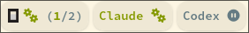
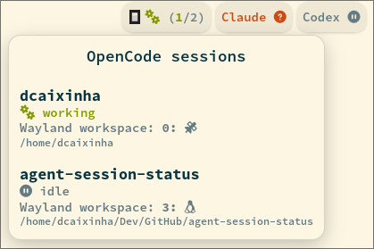
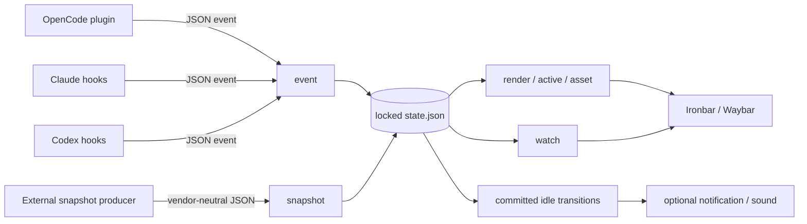

# agent-session-status

[](https://github.com/dcaixinha/agent-session-status/actions/workflows/ci.yml)
[](LICENSE)

Live OpenCode, Claude Code, and Codex session state for Ironbar and Waybar. Provider events are reduced to a small local state store, so the bar can show active work, requests that need attention, and completed turns without scraping terminal output.



*Three local provider segments using the bundled OpenCode image and text-only Claude Code and Codex labels.*

## Features

- Event-driven local updates for multiple simultaneous sessions and subagents.
- Clear priority: `waiting > working > idle`. Any pending permission, question, or elicitation makes a session effectively `waiting`, regardless of its stored status.
- Compact aggregation: `(N)` means all `N` visible main sessions share the displayed state; `(highest/N)` means the numerator is the number in the highest displayed state out of `N` main sessions; `+N` counts non-idle subagents.
- Main sessions remain visible while idle. Subagents are visible only while working or waiting.
- Ironbar popups and Waybar tooltips with project paths and optional Hyprland workspace labels.
- Theme-aware OpenCode images, user-supplied provider images, configurable status glyphs and colors, optional local SVG tinting, and grouped remote sources.
- Opt-in desktop and audio alerts for exact transitions to idle.

## Contents

- [Quick Start](#quick-start)
- [Providers](#providers)
- [Ironbar](#ironbar)
- [Waybar](#waybar)
- [Appearance](#appearance)
- [Idle Alerts](#idle-alerts)
- [Remote Snapshots](#remote-snapshots)
- [Command Reference](#command-reference)
- [State and Lifecycle](#state-and-lifecycle)
- [Hyprland Workspaces](#hyprland-workspaces)
- [Architecture](#architecture)
- [Troubleshooting](#troubleshooting)
- [Development](#development)
- [Licensing](#licensing)

## Requirements

- Linux with `/proc`; process identity, stale-session cleanup, and Hyprland ancestry matching depend on it.
- A stable Rust toolchain with Rust edition 2024 support.
- Ironbar 0.19 or Waybar 0.15 (tested); compatibility with other releases is unverified.
- Font Awesome 7 Free for the default status glyphs.
- At least one supported provider CLI: OpenCode, Claude Code, or Codex.
- Optional: `notify-send` for notifications, and `pw-play` or `paplay` for audio.
- Optional: Hyprland and `hyprctl`; Ironbar can also provide workspace-label mappings automatically.

No provider CLI minimum version is claimed. Provider hook and plugin interfaces can change; compare the supplied integration snippets with the documentation installed with your provider.

## Quick Start

### 1. Clone and install

```sh
git clone https://github.com/dcaixinha/agent-session-status.git
cd agent-session-status
./install.sh
```

The installer builds a release binary and creates these symlinks:

| Destination | Source in this checkout |
|---|---|
| `~/.local/bin/agent-session-status` | `target/release/agent-session-status` |
| `${XDG_DATA_HOME:-~/.local/share}/agent-session-status/*` | OpenCode SVGs, its license, and `assets/agent-complete.wav` |
| `${XDG_CONFIG_HOME:-~/.config}/opencode/plugins/agent-session-status.ts` | OpenCode plugin |

The checkout must remain at the same path after installation because these are symlinks. Moving or deleting it breaks the installed binary, assets, and plugin. Re-run `./install.sh` from the new location if you intentionally move the checkout.

Ensure `~/.local/bin` is on the `PATH` inherited by your status bar and each provider CLI:

```sh
command -v agent-session-status
agent-session-status --version
```

### 2. Connect providers

- OpenCode is connected by the installer. Restart OpenCode.
- For Claude Code, merge [`integrations/claude/settings.json`](integrations/claude/settings.json) into `~/.claude/settings.json`, preserving existing hooks, then restart active sessions.
- For Codex, merge [`integrations/codex/hooks.json`](integrations/codex/hooks.json) into `~/.codex/hooks.json`, preserving existing hooks. Review and trust the commands through Codex's `/hooks` interface.

Do not replace a provider's whole settings or hooks file with the supplied fragment. Merge the named hook arrays so unrelated configuration remains intact.

### 3. Add a status bar

#### Ironbar

Insert the object from [`examples/ironbar-module.json`](examples/ironbar-module.json) into the desired Ironbar `start`, `center`, or `end` array. Add [`examples/ironbar-style.css`](examples/ironbar-style.css) to the active stylesheet. See [Ironbar](#ironbar) for provider substitutions and remote groups.

#### Waybar

Merge the object from [`examples/waybar-module.json`](examples/waybar-module.json) into the Waybar bar object, add `custom/agent-session-opencode` to the desired `modules-left`, `modules-center`, or `modules-right` array, and add [`examples/waybar-style.css`](examples/waybar-style.css) to the active stylesheet. See [Waybar](#waybar) for provider substitutions, click commands, and remote groups.

### 4. Verify

Start a configured provider session, submit a prompt, and inspect the same state the bar integration reads:

```sh
agent-session-status active --provider opencode --source local
agent-session-status render --format details --provider opencode --source local
agent-session-status render --format ironbar --provider opencode --source local
agent-session-status render --format waybar --provider opencode --source local
```

Substitute the provider you configured. `active` exits nonzero until a visible session exists; `render` should then show its status. If the bar is already running, restart it after changing its inherited `PATH` or configuration.

## Providers

### OpenCode

`install.sh` links the TypeScript plugin into `${XDG_CONFIG_HOME:-~/.config}/opencode/plugins/`. The plugin forwards creation, update, deletion, status/idle, permission, and question events. It records OpenCode child sessions as subagents when creation metadata includes a parent.

OpenCode has the richest coverage here: explicit permission and question replies clear the matching pending request. Restart OpenCode after installing or changing the plugin.

### Claude Code

Merge every hook group from [`integrations/claude/settings.json`](integrations/claude/settings.json) into `~/.claude/settings.json`. If a key already exists, append the supplied command object to its array rather than replacing the array. Hooks are loaded when sessions start.

The fragment covers session, prompt, tool, permission, notification, subagent, stop, and elicitation lifecycles. Waiting is inferred from permission requests, matching notification types, user-question tools, and elicitation. Tool completion or the corresponding result moves the session back to working; stop events move it to idle.

### Codex

Merge [`integrations/codex/hooks.json`](integrations/codex/hooks.json) into `~/.codex/hooks.json`, preserving existing descriptions and hooks. Use `/hooks` to inspect and trust the commands.

The supplied Codex fragment covers session start/end, prompts, pre/post tool use, permission requests, subagent start/stop, and stop. Its coverage is intentionally narrower than Claude's fragment: there is no configured permission-reply, notification, tool-failure, stop-failure, or elicitation hook. A pending approval is therefore cleared by the next ordinary tool or turn lifecycle event, and events absent from the fragment cannot affect state.

## Ironbar

### Local provider module

[`examples/ironbar-module.json`](examples/ironbar-module.json) is deliberately local-only: each command includes `--source local`, preventing imported snapshots from appearing in a provider's local segment or popup.

For Claude or Codex, copy the module and substitute all of the following:

- Every `opencode` provider argument with `claude` or `codex`.
- The module `name`, so each custom module is unique.
- The visible popup title.
- Any provider-specific inline environment values you add to `show_if`, image, watch, or popup commands.

The project bundles only OpenCode artwork. For a text-only Claude or Codex module, remove the image widget and remove `--hide-provider` from the watch command. To use your own image, configure it as described under [Custom provider images](#custom-provider-images); you are responsible for having the right to use and modify that file.

The module has three update paths:

| Element | Behavior |
|---|---|
| `show_if` | Polls `active` every 1 second to hide an empty provider. |
| Provider image | Polls `asset` every 1 second so theme or an explicitly configured local tint can be noticed. |
| Bar label | Runs one long-lived `watch`; filesystem changes render immediately, with a 10-second refresh for expiry and pruning. |
| Popup | Polls `render --format popup` every 3 seconds while Ironbar evaluates it. |

The source example uses the exact upstream OpenCode image without tinting.



*The OpenCode session popup, including project paths and resolved Hyprland workspace labels.*

### Grouped remote module

An external snapshot source can be represented as one provider-neutral segment. The `--source` value must match the producer's payload; `--group-source` is valid only with `--source`.

```json
{
  "type": "custom",
  "name": "agent-session-status-remote-lab",
  "class": "agent-session-status",
  "show_if": "poll:1000:agent-session-status active --source remote-lab",
  "bar": [
    {
      "type": "button",
      "on_click": "popup:toggle",
      "label": "{{watch:env AGENT_SESSION_STATUS_SOURCE_LABEL=Remote agent-session-status watch --format ironbar --source remote-lab --group-source}}"
    }
  ],
  "popup": [
    {
      "type": "label",
      "justify": "left",
      "label": "{{poll:3000:agent-session-status render --format popup --source remote-lab}}"
    }
  ]
}
```

Add `--provider claude`, for example, to both the group and popup commands when a source should be filtered to one provider.

## Waybar

### Local provider module

[`examples/waybar-module.json`](examples/waybar-module.json) defines one local OpenCode custom module. Merge its object into the Waybar bar object, then add its key to a module array:

```json
{
  "modules-left": ["custom/agent-session-opencode"]
}
```

Merge that property into the existing bar object rather than replacing the whole config. The example intentionally has no `interval` or `signal`: Waybar starts one long-lived `watch` process, reads one JSON object per output line, and receives filesystem-driven updates immediately. `restart-interval` restarts the process if it exits. `exec-on-event: false` prevents Waybar input events from restarting the watcher, and `hide-empty-text` hides the module while the watcher remains available for future sessions.

For Claude or Codex, copy the module and replace both the module key and every provider argument. Copy the matching CSS selector as well. The initial Waybar integration uses provider text or configured glyphs rather than SVG groups; keep the provider name enabled so each module remains identifiable.

Hovering shows the JSON-provided Pango tooltip. Waybar has no equivalent to Ironbar's dynamic custom popup. To add a user-selected click action, insert an `on-click` command into the module after replacing the placeholder:

```json
{
  "on-click": "your-command-here"
}
```

Waybar runs that value as a shell command. The project does not choose a terminal, launcher, or notification UI on the user's behalf.

The module receives one primary class representing the highest effective visible state: `waiting`, `working`, or `idle`. It also receives `mixed` when visible main sessions do not all share one state, and `empty` when no session is visible. [`examples/waybar-style.css`](examples/waybar-style.css) demonstrates selectors for those classes. Inline Pango markup still colors mixed fractions and individual labels.

### Grouped remote module

Use the same output format with `--source` and `--group-source` for one provider-neutral remote module:

```json
{
  "custom/agent-session-remote-lab": {
    "exec": "env AGENT_SESSION_STATUS_SOURCE_LABEL=Remote agent-session-status watch --format waybar --source remote-lab --group-source",
    "return-type": "json",
    "format": "{text}",
    "escape": false,
    "tooltip": true,
    "hide-empty-text": true,
    "exec-on-event": false,
    "restart-interval": 2
  }
}
```

Add `custom/agent-session-remote-lab` to a Waybar module array and substitute the snapshot source. Add `--provider` to restrict the group to one provider. `AGENT_SESSION_STATUS_SOURCE_LABEL` remains trusted Pango markup; use only a controlled value.

## Appearance

### Images and themes

`agent-session-status asset <provider>` prints a resolved image path. The project bundles exact upstream light and dark OpenCode SVGs under their upstream MIT license. It does not distribute Claude or OpenAI artwork. The initial Waybar integration is text-only and does not use image assets.

Automatic asset theme detection canonicalizes `IRONBAR_CSS`, or `${XDG_CONFIG_HOME:-~/.config}/ironbar/style.css` by default, then inspects the resolved filename. A case-insensitive filename containing exactly the substring `dark` selects the dark asset; every other filename selects light. This works with a `style.css` symlink whose target filename includes `dark`. Set `AGENT_SESSION_STATUS_THEME=light` or `dark` to override it.

Asset lookup checks a theme-specific environment override, a provider-wide override, `${XDG_DATA_HOME:-~/.local/share}/agent-session-status`, each entry in `${XDG_DATA_DIRS:-/usr/local/share:/usr/share}`, and finally development assets. Environment overrides must be absolute paths to files. Conventional XDG filenames are `opencode-logo-<theme>-square.svg`, `claude-logo-<theme>-square.svg`, and `codex-logo-<theme>-square.svg`.

#### Custom provider images

Use one file for both themes:

```sh
export AGENT_SESSION_STATUS_ASSET_CLAUDE=/absolute/path/to/claude.svg
agent-session-status asset claude
```

Or provide theme-specific files:

```sh
export AGENT_SESSION_STATUS_ASSET_CODEX_LIGHT=/absolute/path/to/codex-light.svg
export AGENT_SESSION_STATUS_ASSET_CODEX_DARK=/absolute/path/to/codex-dark.svg
agent-session-status asset codex
```

The variable names use `OPENCODE`, `CLAUDE`, or `CODEX`, optionally followed by `_LIGHT` or `_DARK`. A theme-specific value takes precedence over its provider-wide value. The CLI verifies that an override is absolute and points to a file; PNG and other Ironbar-supported formats can be returned unchanged.

Local SVG tinting is explicit and generic. Supply the exact source color to replace together with one tint mode:

```sh
AGENT_SESSION_STATUS_ASSET_CLAUDE=/absolute/path/to/custom.svg \
  agent-session-status asset claude --status-color --source-color '#123456'
```

`--status-color` uses the highest effective main-session status and its configured color. Only when no main session exists does it use the highest non-idle subagent status; otherwise it falls back to idle. `--foreground-color` first uses `AGENT_SESSION_STATUS_COLOR_FOREGROUND`, then parses the active CSS for whitespace-separated `@define-color fg VALUE;`, and finally uses the theme fallback. Tinting requires a UTF-8 SVG containing the exact source-color string; it replaces every occurrence and fails rather than silently returning an unchanged file. Generated files are atomically cached under `$XDG_RUNTIME_DIR/agent-session-status/assets/`, or `${XDG_CACHE_HOME:-~/.cache}/agent-session-status/assets/` when `XDG_RUNTIME_DIR` is unavailable. Cache identity includes the source content, source color, and target color.

Custom images and generated derivatives are supplied by the user and are not covered by this project's licenses. Ensure that you have permission to copy, display, and modify them and comply with applicable trademark and brand guidelines. Configuring an image does not imply affiliation or endorsement by its owner.

### Labels, icons, and colors

The default icon mode uses Font Awesome question-circle for waiting, gears for working, and circle-pause for idle. `text` prints words and `both` prints glyph plus word. Status and normal labels are escaped before Pango rendering. `AGENT_SESSION_STATUS_SOURCE_LABEL` is the exception: it is intentionally trusted Pango markup for grouped-source icons or labels. Never populate it from untrusted input.

| Variable | Purpose | Default |
|---|---|---|
| `AGENT_SESSION_STATUS_STATE_DIR` | Runtime state override; same as global `--state-dir`. | `${XDG_RUNTIME_DIR:-<system temp>}/agent-session-status` |
| `AGENT_SESSION_STATUS_THEME` | Asset theme: `light`, `dark`, or automatic behavior for other values. | `auto` |
| `AGENT_SESSION_STATUS_COLOR_WAITING` | Waiting text/status tint. | `#e0af68` |
| `AGENT_SESSION_STATUS_COLOR_WORKING` | Working text/status tint. | `#9ece6a` |
| `AGENT_SESSION_STATUS_COLOR_IDLE` | Idle text/status tint. | `#7f849c` |
| `AGENT_SESSION_STATUS_COLOR_FOREGROUND` | Explicit `asset --foreground-color` tint. | Parsed CSS or theme fallback |
| `AGENT_SESSION_STATUS_ASSET_<PROVIDER>` | Absolute custom image path for both themes. | XDG/bundled lookup |
| `AGENT_SESSION_STATUS_ASSET_<PROVIDER>_LIGHT` | Absolute light-theme custom image path. | Provider-wide value or lookup |
| `AGENT_SESSION_STATUS_ASSET_<PROVIDER>_DARK` | Absolute dark-theme custom image path. | Provider-wide value or lookup |
| `AGENT_SESSION_STATUS_DISPLAY` | `icons`, `text`, or `both`; unknown values use icons. | `icons` |
| `AGENT_SESSION_STATUS_ICON_WAITING` | Waiting label, optionally Pango markup. | Font Awesome question-circle |
| `AGENT_SESSION_STATUS_ICON_WORKING` | Working label, optionally Pango markup. | Font Awesome gears |
| `AGENT_SESSION_STATUS_ICON_IDLE` | Idle label, optionally Pango markup. | Font Awesome circle-pause |
| `AGENT_SESSION_STATUS_SOURCE_LABEL` | Trusted Pango label for `--group-source`. | Escaped source ID |
| `AGENT_SESSION_STATUS_WORKSPACE_NAMES` | JSON object mapping compositor workspace names to labels. | Ironbar JSON fallback |
| `IRONBAR_CSS` | Active Ironbar CSS path for asset theme and foreground detection. | `${XDG_CONFIG_HOME:-~/.config}/ironbar/style.css` |
| `IRONBAR_CONFIG` | Ironbar JSON config path searched for workspace `name_map` values. | `${XDG_CONFIG_HOME:-~/.config}/ironbar/config.json` |

These variables must be present in the environment of the process that uses them. In bar command strings, prefix each relevant command with `env NAME=value`.

## Idle Alerts

Idle alerts are disabled by default. Create `${XDG_CONFIG_HOME:-~/.config}/agent-session-status/config.json` to opt in:

```json
{
  "idle_alerts": {
    "notification": false,
    "sound": false,
    "scope": "all",
    "include_subagents": false,
    "sound_file": null,
    "respect_dnd": true,
    "dnd_command": []
  }
}
```

Missing fields use the shown defaults. When the file exists, parsing is strict: unknown fields, malformed JSON, invalid scope values, and wrong value types are errors. `scope` is `all`, `local`, or `remote`. A session is local only when its source and instance are both `local` and it has no snapshot expiry; all others are remote. Main sessions are eligible by default, while `include_subagents: true` also permits subagents.

### Exact transition semantics

The store compares effective state immediately before and after one locked event or snapshot transaction. An alert is eligible only for a session present on both sides that changes from effective `working` or `waiting` to effective `idle`.

- A newly observed idle session does not alert.
- A repeated idle update does not alert.
- Removal, explicit clear, snapshot omission, and TTL/PID/24-hour pruning do not alert.
- Clearing the last pending request can produce `waiting -> idle` when the stored state is idle.
- Every eligible transition in one transaction is deduplicated by session key, then batched into one notification and one sound.
- Scope and subagent filters are applied after transition detection and before delivery.

Notifications execute `notify-send` with an app name, normal urgency, and a plain-text summary. Sound uses the bundled short robotic completion sound, separately released under CC0 1.0. Set `sound_file` to an absolute path, a `~/` path, or a path relative to the alert config directory. Playback tries `pw-play`, then `paplay`, in the background.

`dnd_command` is an argv array, not a shell string: its first item is the executable and remaining items are literal arguments. When sound and `respect_dnd` are enabled, trimmed case-insensitive output `true`, `1`, `yes`, or `on` suppresses sound. A nonzero exit, spawn/read failure, or the two-second timeout also suppresses sound. Empty `dnd_command` means DND cannot be detected and sound is allowed. DND does not suppress notification submission.

```json
{
  "idle_alerts": {
    "notification": true,
    "sound": true,
    "dnd_command": ["my-dnd-query", "--plain"]
  }
}
```

Use `agent-session-status alert-test` to exercise configured delivery. It synthesizes one local main OpenCode idle session in the current directory and obeys normal scope filtering, so `scope: "remote"` can make it succeed without delivering anything. It does not test transition detection, remote formatting, subagent filtering, or mutate/create the state store. Disabled delivery and malformed config are hard errors for this command.

Normal `event` and `snapshot` ingestion is fail-soft for alert configuration and delivery: state is committed first, then errors are printed as warnings while the hook still exits successfully.

## Remote Snapshots

The core does not discover remote systems. A vendor-neutral external producer is responsible for discovery, transport, authentication, provider inspection, and periodically piping JSON to `agent-session-status snapshot`:

```sh
remote-session-producer | agent-session-status snapshot
```

### Schema

```json
{
  "source": "remote-lab",
  "ttl_seconds": 90,
  "instances": [
    {
      "id": "host-a",
      "label": "Build machine",
      "sessions": [
        {
          "id": "session-42",
          "provider": "opencode",
          "status": "working",
          "cwd": "/work/project"
        }
      ]
    },
    {
      "id": "host-b",
      "label": "Temporarily unavailable"
    }
  ]
}
```

| Field | Required | Accepted values and validation |
|---|---|---|
| `source` | Yes | String with at least one non-whitespace character. Namespaces all imported keys. |
| `ttl_seconds` | Yes | Unsigned integer whose addition to the current Unix timestamp does not overflow. Zero is valid but expires immediately. |
| `instances` | Yes | Array; instance IDs must be unique within the payload. |
| `instances[].id` | Yes | String with at least one non-whitespace character. |
| `instances[].label` | No | String or `null`; display label for the instance. |
| `instances[].sessions` | No | Array of sessions, `null`, or omitted. Presence has authoritative meaning below. |
| `sessions[].id` | Yes | Nonblank string; `(provider, id)` must be unique within its instance. |
| `sessions[].provider` | Yes | `opencode`, `claude`, or `codex`. |
| `sessions[].status` | Yes | `idle`, `working`, or `waiting`. |
| `sessions[].cwd` | Yes | String displayed as the working directory. |

Invalid payloads fail before mutating the store. Unknown JSON fields are currently ignored; producers should not rely on them being retained.

### Authoritative update matrix

| Payload condition | Result |
|---|---|
| Instance has a nonempty `sessions` array | Replace all prior sessions for that source/instance; set their expiry to ingestion time plus `ttl_seconds`. |
| Instance has `"sessions": []` | Remove all sessions for that source/instance. |
| Instance omits `sessions` or sets it to `null` | Retain sessions and their existing expiry, but update each retained session's label to the supplied label or `null`. TTL is not renewed. |
| Previously known instance is omitted from `instances` | Remove it immediately for this source. |
| Different source or local sessions exist | Leave them unchanged. |

Expired imported sessions are pruned whenever state is loaded or updated; `watch` forces a load every 10 seconds, so an otherwise quiet bar drops expired data within that cadence. Imported sessions are always main sessions with no PID, process-start identity, pending-request set, or Hyprland workspace association. Producers must calculate effective status themselves and publish `waiting` directly.

Filtering composes:

```sh
agent-session-status render --format details --source remote-lab
agent-session-status render --format popup --source remote-lab --provider claude
agent-session-status watch --format ironbar --source remote-lab --group-source
agent-session-status watch --format waybar --source remote-lab --group-source
```

Grouped output uses all selected sessions, the highest status, and `(N)` or `(highest/N)` aggregation. Source-filtered details and popup formats identify each instance and provider.

## Command Reference

`--state-dir <PATH>` is a global option accepted before or after subcommands and is also read from `AGENT_SESSION_STATUS_STATE_DIR`. Root options also include `-h`/`--help` and `-V`/`--version`; every subcommand supports `-h`/`--help`. Commands return exit status 0 on success and nonzero on parse, input, state, render, or delivery errors, with the exceptions noted below.

| Command | Options / input | Output and exit behavior |
|---|---|---|
| `event <PROVIDER>` | Provider is `opencode`, `claude`, or `codex`; reads one provider JSON event from stdin. | No stdout. Invalid JSON/state errors are nonzero. Recognized and unrecognized valid event objects commit successfully; alert failures only warn. |
| `snapshot` | Reads one remote snapshot JSON object from stdin. | No stdout. Schema/validation/state errors are nonzero; alert failures after commit only warn. |
| `render` | `--format ironbar\|waybar\|details\|popup\|json`, `--provider`, `--source`, `--group-source`, `--hide-provider`. | Prints one result and exits. Format defaults to `ironbar`. `--group-source` requires `--source`; `--hide-provider` affects non-grouped bar output. Empty output is still success. |
| `watch` | Same options and defaults as `render`. | Prints immediately and after state changes or each 10-second timeout; flushes each result and runs until interrupted or a watcher/render error. |
| `active` | `--provider`, `--source`. | No stdout. Success if any matching main session exists at any status, or any matching subagent is non-idle; otherwise nonzero with `no active sessions`. |
| `clear` | No command-specific options. | Atomically removes all tracked sessions; success even when already empty. It does not emit idle alerts. |
| `alert-test` | No command-specific options. | Tests configured delivery with synthetic local data without opening state. Nonzero when alerts are disabled or config/delivery fails. |
| `asset <PROVIDER>` | `--status-color` or mutually exclusive `--foreground-color`; either tint requires `--source-color`. | Prints the resolved original image or cached tinted SVG path. Nonzero for a missing/invalid override, missing source color, non-SVG tint source, or file/cache error. |
| `help [COMMAND]` | Optional subcommand name. | Prints root or command help and exits successfully. Invalid command names are nonzero. |

Formats:

| Format | Intended use |
|---|---|
| `ironbar` | One Pango-marked aggregate label per provider, or one grouped source segment. |
| `waybar` | One compact Waybar custom-module JSON object containing Pango `text`, a multiline `tooltip`, and dynamic `class` values. This is distinct from internal-state JSON. |
| `details` | Plain line-oriented session summary, with escaped markup-sensitive characters. |
| `popup` | Multiline Pango markup with project paths and optional workspace labels. |
| `json` | Compact serialization of the filtered internal `State` object; this is an inspection format, not the snapshot input schema. |

Use `agent-session-status <command> --help` as the authoritative option list for the installed build.

## State and Lifecycle

Runtime state defaults to `${XDG_RUNTIME_DIR:-<system temp>}/agent-session-status/state.json`; the sibling `state.lock` serializes readers and writers. Alert configuration instead uses XDG config, installed assets use XDG data, and tinted assets use XDG runtime storage with an XDG cache fallback. These paths intentionally serve different lifetimes.

Writes serialize to `state.json.<writer-pid>.tmp` and atomically rename it over `state.json` while holding an exclusive lock. State is rewritten only when it changed.

Local provider events walk `/proc` ancestry to find the provider process and save both PID and Linux process-start ticks. A session with a PID is retained only while that exact PID/start pair still exists, preventing PID reuse from preserving stale state. Local sessions without a PID are retained for at most 24 hours since their last event. Remote sessions use only their explicit TTL. Pruning occurs before and after updates and during render, active, asset status tint, and watch reads. `clear` removes everything under the same lock.

`watch` subscribes non-recursively to the state directory, ignores access-only events, coalesces atomic-write bursts for 15 ms, and also reloads every 10 seconds so time-based pruning appears without another event.

## Hyprland Workspaces

When `HYPRLAND_INSTANCE_SIGNATURE` exists, popup rendering runs `hyprctl -j clients`, keeps mapped clients, and maps their PIDs to workspace names. For each local session PID, it walks the process and parent ancestry and uses the nearest ancestor that owns a mapped Hyprland window. This commonly associates the provider process with its terminal window.

Labels are taken first from `AGENT_SESSION_STATUS_WORKSPACE_NAMES`, a JSON object such as `{"1":"main","2":"browser"}`. Otherwise the program recursively searches the JSON file at `IRONBAR_CONFIG` for `type: "workspaces"` objects and their `name_map` strings. Waybar users should set the explicit environment variable when raw Hyprland workspace names are not sufficient.

Limitations: remote snapshots have no PID; malformed or non-JSON Ironbar configs yield no labels; failed `hyprctl` calls are ignored; unmapped clients are excluded; and the standard `ext-workspace` protocol does not associate arbitrary toplevels with workspaces. Other compositors need their own external association strategy.

## Architecture



| Module | Responsibility |
|---|---|
| `src/main.rs` | CLI definition, stdin parsing, command dispatch, fail-soft ingestion alerts. |
| `src/model.rs` | Provider/status/session model, effective waiting, collision-safe keys. |
| `src/event.rs` | Provider event normalization and main/subagent lifecycle reduction. |
| `src/snapshot.rs` | Vendor-neutral snapshot schema, validation, authoritative replacement. |
| `src/store.rs` | XDG runtime paths, locking, atomic persistence, transitions, pruning, watch loop. |
| `src/render.rs` | Filtering, visibility, aggregation, formats, Pango output, colors and icons. |
| `src/assets.rs` | Theme selection, custom/XDG asset resolution, generic explicit tinting, and cache. |
| `src/alert.rs` | Alert policy, batching, DND query, notification and sound delivery. |
| `src/process.rs` | Linux `/proc` provider ancestry and PID/start identity. |
| `src/workspace.rs` | Hyprland client ancestry and optional workspace-name mapping. |

## Troubleshooting

| Symptom | Check |
|---|---|
| `agent-session-status: command not found` | Put `~/.local/bin` on the provider CLI's and status bar's inherited `PATH`; confirm the installer symlink target still exists. |
| Provider never appears | Confirm its integration was merged and the session restarted; run `render --format json --provider ... --source local`. |
| `active` says no sessions but JSON has an idle subagent | Idle subagents are intentionally not visible or active. Main sessions remain active while idle. |
| A session remains waiting | Pending input overrides stored status. Confirm the provider emits a matching reply/result; Codex coverage clears approvals only on a later lifecycle event. |
| Wrong provider image theme | Inspect the canonical target filename of `IRONBAR_CSS`; set `AGENT_SESSION_STATUS_THEME` explicitly if it does not contain `dark`, and check theme-specific asset overrides. |
| Custom provider image is missing | Use an absolute `AGENT_SESSION_STATUS_ASSET_<PROVIDER>` path, or install the conventional filename in an XDG data directory. Claude and Codex images are not bundled. |
| Tinting fails or is unchanged | Pass one tint option plus the exact, case-sensitive SVG source string through `--source-color`; PNG and other non-SVG files cannot be tinted. |
| Foreground tint is wrong | Ensure the active CSS has a whitespace-tokenizable `@define-color fg VALUE;`, or set `AGENT_SESSION_STATUS_COLOR_FOREGROUND`. |
| Glyphs are boxes | Install Font Awesome 7 Free or override the three icon variables/text mode. |
| Popup has no workspace label | Check Hyprland environment inheritance, `hyprctl -j clients`, process ancestry, JSON `IRONBAR_CONFIG`, or explicit workspace-name JSON. |
| Waybar module never appears | Set `return-type` to `json`, omit `interval` and `signal`, enable `hide-empty-text`, and run the documented `watch --format waybar` command in a terminal. |
| Waybar tooltip shows markup literally | Set `escape` to `false` and do not set `tooltip-format`, which would override the JSON tooltip. |
| Remote sessions vanish | The producer omitted an instance, sent an empty session array, stopped refreshing before TTL, or used `ttl_seconds: 0`. |
| No sound | Enable `sound`, check the audio tools and file, and test the DND command directly; any DND command failure suppresses sound. |
| Hooks report alert warnings | State was still committed. Run `alert-test` to get a hard config/delivery error and inspect the XDG config path. |
| State looks stale | Run `agent-session-status clear`, then restart current provider sessions so their integrations republish state. |

## Development

Run the same gates as CI:

```sh
cargo fmt --check
cargo clippy --locked --all-targets --all-features -- -D warnings
cargo test --locked --all-features
cargo build --locked --release --all-features
```

Unit tests cover provider lifecycle reduction, effective waiting, rendering/counts, Waybar JSON, snapshot replacement and validation, state pruning/transitions, asset parsing, workspace mapping, and alert policy through mock command runners. Integration tests cover fail-soft malformed alert configuration, `alert-test` state isolation, and immediate/filesystem-driven Waybar watch output.

Live gaps remain outside automated coverage: actual provider plugin/hook compatibility, Ironbar rendering and popup behavior, Waybar/Pango/CSS appearance, filesystem watcher differences, desktop notification daemons, PipeWire/PulseAudio playback, DND utilities, Hyprland IPC, installed fonts, and appearance across themes. Test these manually when changing their boundaries. Tests must never emit real notifications or sounds.

Contributor invariants and verification guidance are in [`AGENTS.md`](AGENTS.md).

## Licensing

- Project code is licensed under the [MIT License](LICENSE).
- The exact OpenCode square assets retain their [upstream MIT license](assets/LICENSE.OpenCode) and copyright notice.
- [`assets/agent-complete.wav`](assets/agent-complete.wav) is separately available under CC0 1.0; provenance and modifications are in [`THIRD_PARTY_NOTICES.md`](THIRD_PARTY_NOTICES.md).
- Claude, OpenAI, Codex, OpenCode, and their marks belong to their respective owners. This project is independent and is not affiliated with, sponsored by, or endorsed by those providers. Provider names identify compatibility only; custom user assets remain subject to their owners' terms.
